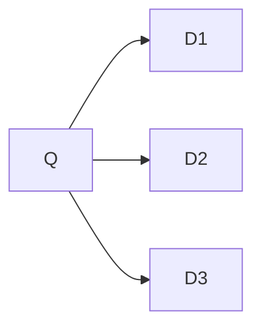

# BM25

## Uncertainties in IR

Query representation yang merupakan natural language pada google belum tentu bisa merepresentasikan apa yang ada di dalam kepala kita.

Teori probabilitas itu menjadi principle foundation untuk mealkukan reasoning yang melibatkan ketidakpastian.

Model yang kita pelajari itu sekarang ada 2, ada yang boolean retrieval, dan ada ranked retrieval.

Pada ranked retrieval, kita sudah membahas vector state machine, kemudian ada pula probibility information retrieval.

## Probabilistic Ranking Model

- Dokumen di ranking berdasarkan probabilitas relevansinya terhadap kebutuhan dokumensi
- Disusun terurut mengecil dari probabilitas yang paling besar.

$$
P (R = 1 | d, q)
$$

## Probability Ranking Principle

> “If a reference retrieval system’s response to each request is a ranking of the documents in the collection in order of decreasing probability of relevance to the user who submitted the request, where the probabilities are estimated as accurately as possible on the basis of whatever data have been made available to the system for this purpose, the overall effectiveness of the system to its user will be the best that is obtainable on the basis of those data.”

[Gerard Salton](https://en.wikipedia.org/wiki/Gerard_Salton) Founding father of IR

### Okapi BM25

- BM25 = Best Match 25

Banyak sukses di kompetisi TREC (Text Retrieval Conference).

- Goal: sensitif terhadap term frekuensi dan panjang dokumen sementara parameternya tidak ditambahkan terlalu banyak.

Semuanya dimulai dari Odds di teori probabilitas
$$
score(Q, D) = O(R | (Q, \vec{TF})) = \frac{P(R = 1|(Q, \vec{TF}))}{P(R = 0|(Q, \vec{TF}))}
$$
TF vector itu merepresentasikan dokumennya, misal:

- Vocab = {kernel, dan, model}

- D1: model, dan, kernel, kernel, dan, dan Vektor

- TF D1 -> [2, 3, 1]

  
  $$
  \begin{align}
  \mathsf P(R\mid H, S) & = \frac{\mathsf P(R,H,S)}{\mathsf P(H, S)}
  \\[1ex] & =\frac{\mathsf P(H\mid R,S)\,\mathsf P(R, S)}{\mathsf P(H, S)}
  \\[1ex] & =\frac{\mathsf P(H\mid R,S)\,\mathsf P(R\mid S)\,\mathsf P(S)}{\mathsf P(H, S)}
  \\[1ex] & =\frac{\mathsf P(H\mid R,S)\,\mathsf P(R\mid S)}{\mathsf P(H\mid S)}\frac{\mathsf P(S)}{\mathsf P(S)}
  \\[1ex] & =\frac{\mathsf P(H\mid R,S)\;\mathsf P(R\mid S)}{\mathsf P(H\mid S)}
  \end{align}
  $$
  For both top and bottom equation, replace $S$ with $Q$ and $\vec{TF}$ with $H$.

  Pay attention that: $O(R | Q) = \frac{P(R = 1 | Q)}{P(R = 0 | Q)}$.

  Define Odds as:

  Definisikan $R$ sebagai variabel bahwa itu relevan atau tidak. $R = 1$ artinya dia relevan.

  $Q$ itu querynya dia, dan $\vec{TF}$ dengan ukuran $n$ itu merupakan term frequency untuk certain dokumen ini, dengan entri ke-$i$ adalah banyaknya dokumen ke-$i$.

  

$$
\begin{aligned}
O(R \mid Q, \overrightarrow{T F}) &=\frac{P(R=1 \mid Q, \overrightarrow{T F})}{P(R=0 \mid Q, \overrightarrow{T F})} \\
&=\frac{P(R=1 \mid Q) P(\overrightarrow{T F} \mid R=1, Q)}{P(R=0 \mid Q) P(\overrightarrow{T F} \mid R=0, Q)} \\
&=O(R \mid Q) \prod_{i=1}^n \frac{P\left(T F_i \mid R=1, Q\right)}{P\left(T F_i \mid R=0, Q\right)}
\end{aligned}
$$

$$
O(R \mid Q, \overrightarrow{T F})=O(R \mid Q) \prod_{T F_i>0} \frac{P\left(T F_i \mid R=1, Q\right)}{P\left(T F_i \mid R=0, Q\right)} \prod_{T F_i=0} \frac{P\left(T F_i \mid R=1, Q\right)}{P\left(T F_i \mid R=0, Q\right)}
$$
Jika kita asumsikan untuk semua term yang tidak muncul di Query:
$$
P\left(T F_i=t f_i \mid R=1, Q\right)=P\left(T F_i=t f_i \mid R=0, Q\right)
$$
$$
O(R \mid Q, \overrightarrow{T F})=O(R \mid Q) \prod_{\substack{T F_i>0 \\ T F_i^Q>0}} \frac{P\left(T F_i=t f_i \mid R=1, Q\right) P\left(T F_i=0 \mid R=0, Q\right)}{P\left(T F_i=t f_i \mid R=0, Q\right) P\left(T F_i=0 \mid R=1, Q\right)} \prod_{T F_i^Q>0} \frac{P\left(T F_i=0 \mid R=1, Q\right)}{P\left(T F_i=0 \mid R=0, Q\right)}
$$

$T F_i$ : Frekuensi term i di dokumen
$T F_i^Q:$ Frekuensi term i di query

Misalkan kita ada scoring:

- $score(Q, D) = O(R\mid Q) \displaystyle\prod_{i = 1}^n\frac{P(TF_i \mid R = 1, Q)}{P(TF_i \mid R = 0, Q)}$

Pertanyaan:

- $tf_i$ kecil itu maksudnya apa
- Turuninnya gimana buat dapet yang product itu

